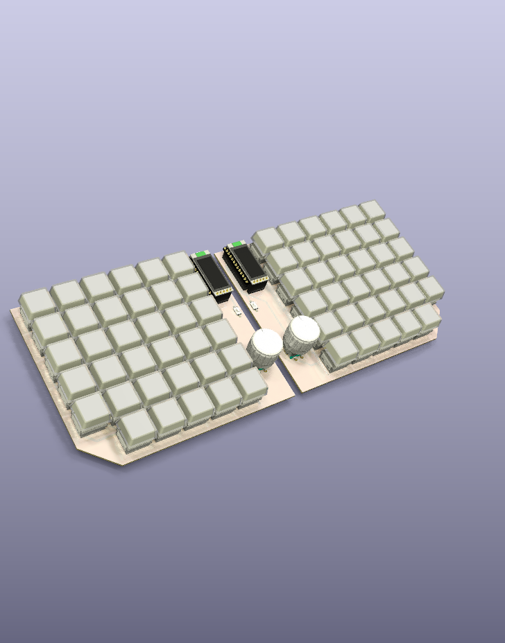
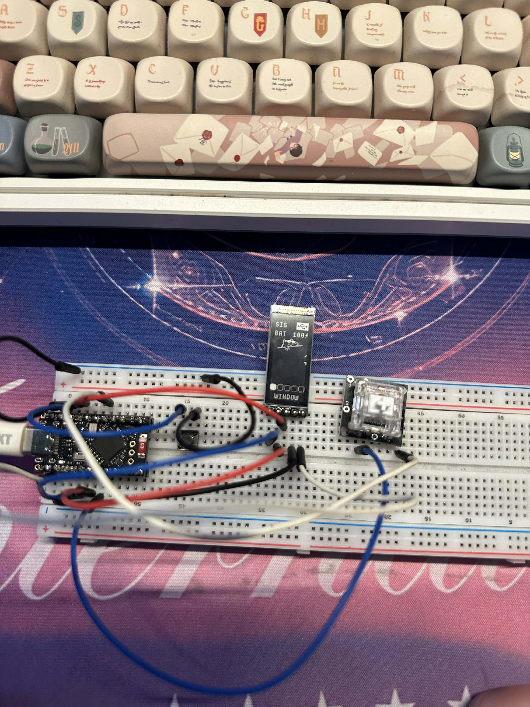

# CHUNCHUN

Wireless split ortholinear keyboard with 70 keys, 2 nice!view displays, 2 rotary encoders.

Original inspirated by Sofle keyboard, but I want to add more keys (F-rows) and ortholinear layout. I also want to add 2 nice!view displays and 2 rotary encoders for better user experience.

## Images

`TBA`

## Specifications

- 70 keys
- 2 nice!view displays
- 2 rotary encoders (EC11)
- Wireless connection (nice!nano or similar) with ZMK firmware support

## Firmware

[chunchunkb-zmk](https://github.com/qwerty22121998/chunchunkb-zmk)

## Bill of materials
- This only include one side of the keyboard, so you need to double the quantity for the whole keyboard.

| Value                                         | Qty |
|-----------------------------------------------|-----|
| Nice!nano or similar                          | 1   |
| Nice!view or oled                             | 1   |
| SMD 1N4148W                                   | 36  |
| MX Hotswap socket                             | 35  |
| SK6812MINI-E                                  | 35  |
| EC11                                          | 1   |
| MX1.25 Ultra Thin Battery socket (or smiliar) | 1   |
| PCM12 Switch or smiliar                       | 1   |
| Reset switch                                  | 1   |

### Symbols & footprints

- <https://github.com/foostan/kbd>
- <https://github.com/bstiq/nice-nano-kicad>
- <https://github.com/HookyQR/nice_view_pcb>
- <https://github.com/tzarc/reversible-kicad/>

### 3D models

- <https://grabcad.com/library/dip24w-socket-with-ic-1>
- <https://grabcad.com/library/cherry-mx-1>
- <https://grabcad.com/library/mx-cherry-relegendable-keycaps-1>
- <https://grabcad.com/library/ec11-rotary-encoder-dode-switch-15mm-1>
- <https://grabcad.com/library/knobs-15>
- <https://grabcad.com/library/dsa-keycap-for-cherry-mx-switches-1>
